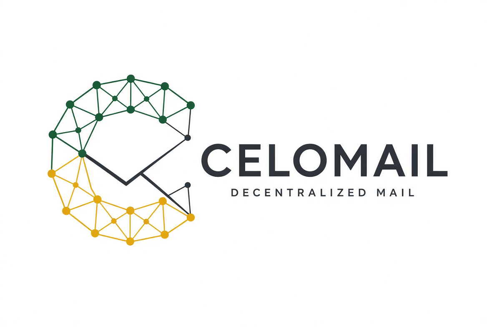

# 🟡 CeloMail

CeloMail is a fully decentralized, end-to-end encrypted Web3 messaging application built on the **Celo** blockchain. 

By combining the immutability of smart contracts with the decentralized storage of **IPFS**, CeloMail ensures that your communications remain entirely private, secure, and uncensorable.



## ✨ Features

- **End-to-End Encryption**: Message payloads are encrypted locally in your browser using the recipient's public key before ever leaving your device. Only the intended recipient can decrypt the message.
- **Cryptographic Signatures**: Senders cryptographically sign their messages with their wallet. Receivers see a "Verified Signature" badge, proving the message wasn't spoofed or tampered with.
- **Rich Text & Attachments**: Compose messages using a full Rich Text Editor (React-Quill) and attach files up to 5MB natively.
- **Decentralized Storage (IPFS)**: Encrypted JSON payloads (containing the text, signature, and attachment CID) are pinned to IPFS via Pinata.
- **On-Chain Message Routing**: The `DecentralizedMail` Solidity smart contract maps user aliases (e.g, `satoshi@cmail.com`) to their wallet addresses and keeps an immutable registry of message CIDs.
- **Auto-Saving Drafts**: Real-time auto-saving to MongoDB ensures you never lose a message while composing.
- **Email Notifications**: Users can opt-in via the Settings modal to receive Web2 email notifications (powered by Nodemailer) whenever they receive a Web3 message.
- **Web3 Identity (AppKit)**: Seamless login using any major Web3 wallet via Reown/AppKit and Wagmi.
- **Off-Chain Address Book**: A MongoDB-powered backend allows you to maintain a private, encrypted contact list of aliases without paying gas fees for address book management.
- **Premium UI**: A sleek, fully responsive dashboard built with Tailwind CSS, Framer Motion, and a vibrant yellow color scheme, complete with pagination and background polling for new messages.

## 🏗️ Architecture

- **Frontend**: Next.js (App Router), React, Tailwind CSS, Lucide React
- **Web3**: Wagmi, Viem, Reown AppKit
- **Smart Contracts**: Solidity, Hardhat, deployed on Celo
- **Storage**: IPFS (Pinata SDK)
- **Database**: MongoDB (Mongoose)

## 🚀 Getting Started

### Prerequisites
- Node.js (v18+)
- MongoDB connection string (e.g., MongoDB Atlas)
- Pinata API Keys (for IPFS pinning)
- A Web3 Wallet (MetaMask, Valora, etc.)

### 1. Clone the Repository
```bash
git clone https://github.com/yourusername/cmail.git
cd cmail
```

### 2. Frontend Setup
```bash
cd frontend
npm install
```

Create a `.env.local` file in the `frontend` directory:
```env
NEXT_PUBLIC_PINATA_JWT=your_pinata_jwt
NEXT_PUBLIC_PROJECT_ID=your_reown_project_id
MONGODB_URI=your_mongodb_connection_string
EMAIL_USER=your_gmail_address
EMAIL_PASS=your_gmail_app_password
```

Start the frontend development server:
```bash
npm run dev
```
The app will be running at `http://localhost:3000`.

### 3. Smart Contract Setup
If you need to deploy the contract yourself (optional, as the frontend uses a pre-deployed address):

```bash
cd contract
npm install
```

Create a `.env` file in the `contract` directory:
```env
PRIVATE_KEY=your_wallet_private_key
```

Deploy to Celo Alfajores Testnet:
```bash
npx hardhat run scripts/deploy.js --network alfajores
```
*Note: Update the contract address in `frontend/src/utils/abi.ts` after deployment.*

## 📖 How to Use

1. **Connect Wallet**: Click "Connect Wallet" on the landing page to authenticate.
2. **Claim Identity**: If it's your first time, register a unique alias (e.g., `alice`) which becomes `alice@cmail.com`.
3. **Add Contacts**: Navigate to the "Contacts" tab to save aliases to your address book.
4. **Send a Message**: Go to "Drafts" (or click "Reply"), enter a recipient's alias, type your message, and click "Encrypt & Send". You will be prompted to sign a transaction.
5. **Read Messages**: Your Inbox will automatically fetch and decrypt messages sent to you. Click on any message to read the full content in the Message Details view.

## 🔐 Security Note

While CeloMail encrypts message content, metadata such as the sender's address, recipient's address, and the timestamp of the message are stored on-chain (publicly visible on the block explorer). Do not send sensitive information in the Subject line, as only the body payload is encrypted and sent to IPFS.

## 📄 License

This project is licensed under the MIT License.
