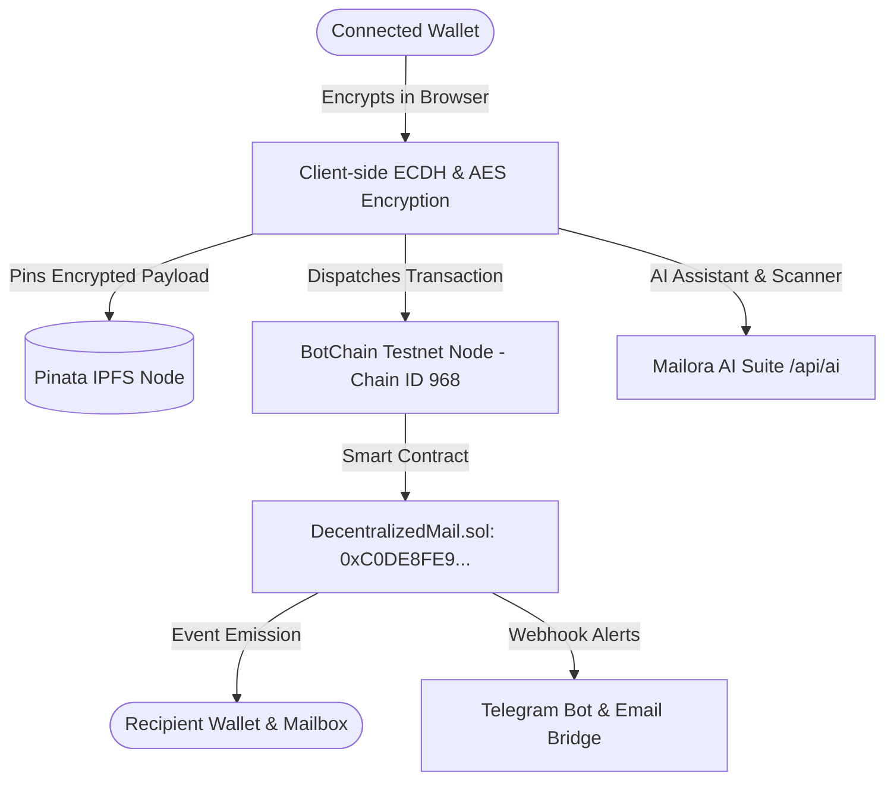

# ✦ Mailora — AI-Powered Decentralized Web3 Mailbox

<div align="center">
  
  <br />
  <p><strong>Decentralized, End-to-End Encrypted, AI-Supercharged Web3 Messaging on BotChain Testnet</strong></p>
  
  <p>
    <a href="https://cmail-peach.vercel.app"></a>
    <a href="https://github.com/webtrovert0x/Mailora/blob/main/WHITEPAPER.md"></a>
    <a href="https://t.me/MailoraAlertsBot"></a>
    <a href="https://scan.bohr.life/address/0xC0DE8FE984F889f8a7367BD1DE8DBBBFB05cE13a"></a>
    
    
  </p>
</div>

---

## 🌟 Overview

**Mailora** is a state-of-the-art decentralized mailbox operating natively on **BotChain Testnet (Chain ID 968)** with native token **Botcoin (`BOT`)**. 

By combining client-side zero-knowledge encryption, decentralized **IPFS** payload pinning, on-chain `@mailora` human-readable identity routing, and native **Neural AI Superpowers**, Mailora eliminates censorship, phishing threats, and tracking inherent to centralized email providers.

---

## ⚡ Core Features & Capabilities

### 🧠 1. Mailora AI Neural Suite
- **AI Smart Compose & Tone Rewriter**: Draft entire emails from simple prompts or rewrite drafts across 5 distinct tones (*Professional*, *Friendly*, *Web3 Native*, *Ultra Concise*, *Persuasive*).
- **AI Phishing & Threat Shield**: Real-time message inspection that flags dangerous links, malicious contracts, fake airdrop scams, and seed phrase harvesting attempts.
- **AI 1-Click Executive Summarizer**: Automatically extracts structured bullet points, key takeaways, action items, and urgency indicators from long messages.
- **AI Smart Quick Replies**: Context-aware, one-click reply recommendations tailored to incoming messages.

### 💰 2. Token & BOT Payment Attachments ("Pay-with-Mail")
- **Direct Crypto Transfers**: Attach native Botcoin (`BOT`) directly inside an encrypted email.
- **On-Chain Verification**: Recipients receive a verified payment card with transaction hash and direct link to the BotChain Block Explorer.

### ⛽ 3. Gasless Sponsored Relayer Mode
- **Zero-Gas Onboarding**: New users can claim their `@mailora` handle and dispatch encrypted messages with zero gas via the serverless sponsored relayer (`/api/relayer`).

### 👥 4. Gmail-Style Multi-Recipient Tag Input & Autocomplete
- **Interactive Chips / Tags**: Send to one or multiple recipients simultaneously with interactive avatar initial chips (`[G] gate.io@mailora (x)`).
- **Live Directory Autocomplete**: Real-time suggestions from your Address Book, recent inbox senders, and dispatched contacts.
- **Keyboard Triggers**: Convert entered text to chips via <kbd>Enter</kbd>, <kbd>,</kbd>, <kbd>Space</kbd>, or <kbd>Tab</kbd>.

### ⏰ 5. Scheduled Dispatch & Snooze
- **Scheduled Sending**: Schedule encrypted messages for future delivery (*In 1 Hour*, *Tomorrow Morning*, *Custom Date/Time*) with a dedicated **Scheduled** dashboard view.
- **Message Snoozing**: Temporarily hide incoming messages from your inbox (*1 Hour*, *24 Hours*, *7 Days*) to revisit when ready.

### 🔔 6. Telegram & Web2 Notification Bridge
- **Telegram Bot Alerts**: Link your Telegram Chat ID in Settings to receive instant push alerts when new encrypted messages arrive at your `@mailora` handle.
- **Web2 Email Bridge**: Optional private email notifications via Nodemailer SMTP.

### 🔐 7. Decentralized Privacy & Security
- **Local Client-Side Encryption**: Payloads are encrypted and decrypted locally in-browser using recipient public keys before ever touching the network.
- **Verified Cryptographic Signatures**: Senders sign messages with their connected wallet to prove identity authenticity.
- **Permanent On-Chain Identity**: Mandatory `@mailora` handles mapped permanently to wallet addresses on BotChain.
- **IPFS Pinning**: Messages and file attachments up to 5MB are pinned to decentralized IPFS storage.

---

## 🌐 Network Information: BotChain Testnet

| Parameter | Value |
|---|---|
| **Network Name** | BotChain Testnet (Bohr) |
| **Chain ID** | `968` |
| **RPC URL** | `https://rpc.bohr.life` |
| **Block Explorer** | [https://scan.bohr.life](https://scan.bohr.life) |
| **Native Currency** | Botcoin (`BOT`, 18 Decimals) |
| **Deployed Smart Contract** | [`0xC0DE8FE984F889f8a7367BD1DE8DBBBFB05cE13a`](https://scan.bohr.life/address/0xC0DE8FE984F889f8a7367BD1DE8DBBBFB05cE13a) |

---

## 🏗️ Architecture & Technology Stack



- **Frontend**: Next.js 16 (App Router), React 19, Tailwind CSS, Framer Motion, Lucide Icons, React-Quill
- **Web3 Layer**: Wagmi, Viem, Reown AppKit
- **Smart Contracts**: Solidity 0.8.24 (`DecentralizedMail.sol`), Hardhat
- **Decentralized Storage**: IPFS (Pinata SDK)
- **Database**: MongoDB (Mongoose) for address books, preferences, drafts, and scheduled queues
- **AI Engine**: Google Gemini API (`gemini-3.5-flash`, `gemini-flash-latest`) & contextual fallback

---

## 🚀 Quickstart & Setup Guide

### 1. Clone the Repository
```bash
git clone https://github.com/webtrovert0x/celomail.git mailora
cd mailora
```

### 2. Environment Configuration
In `frontend/.env.local`:
```env
# Reown AppKit Project ID (https://dashboard.reown.com)
NEXT_PUBLIC_PROJECT_ID=your_reown_project_id

# Pinata IPFS JWT
NEXT_PUBLIC_PINATA_JWT=your_pinata_jwt_token

# MongoDB Connection
MONGODB_URI=your_mongodb_connection_string

# AI Suite (Google Gemini or OpenAI)
GEMINI_API_KEY=your_gemini_api_key

# Gasless Relayer Key (BotChain Testnet)
BOTCHAIN_RELAYER_KEY=your_relayer_private_key

# Optional: Web2 Email Notification Bridge
EMAIL_USER=your_email@gmail.com
EMAIL_PASS=your_gmail_app_password

# Optional: Telegram Notification Bot Token
TELEGRAM_BOT_TOKEN=your_telegram_bot_token
```

### 3. Run the Development Server
```bash
cd frontend
npm install
npm run dev
```
Open [http://localhost:3000](http://localhost:3000) in your browser to launch Mailora.

### 4. Smart Contract Compilation & Deployment (Hardhat)
```bash
cd contract
npm install
npx hardhat compile
npx hardhat run scripts/deploy.js --network botchain
```

---

## 📄 License
Released under the [MIT License](LICENSE).
