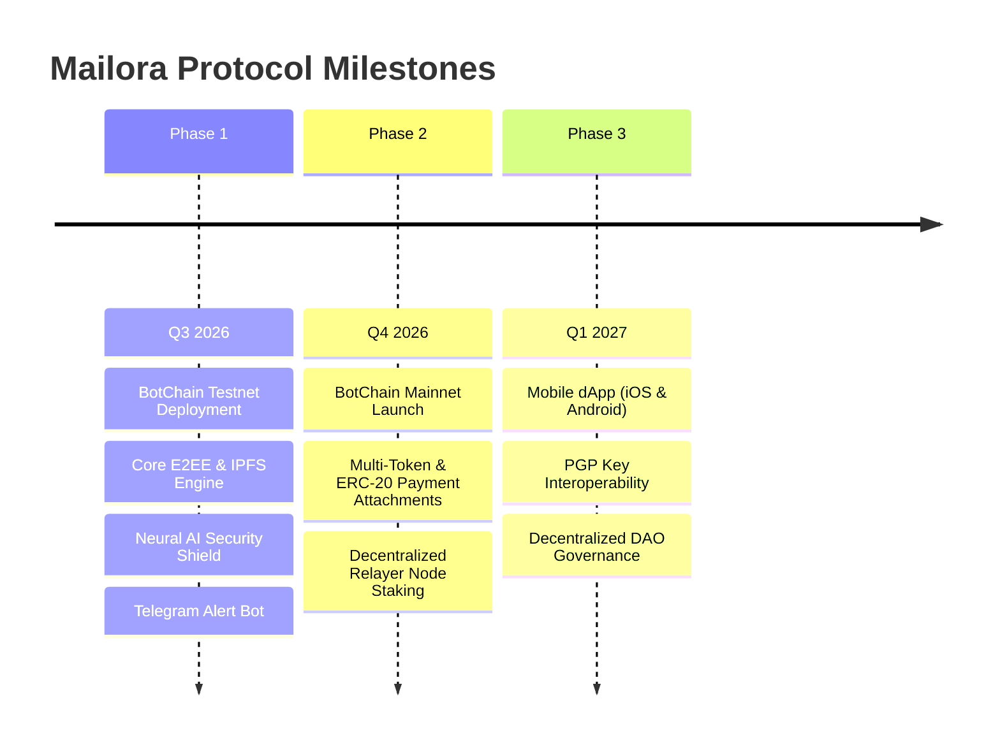

# 📄 Mailora Whitepaper v1.0
### The AI-Powered, Decentralized & End-to-End Encrypted Web3 Messaging Protocol on BotChain

**Date:** September 2026  
**Authors:** Mailora Core Protocol Contributors  
**Network:** BOT Chain (Chain ID 677)  
**Website:** [https://cmail-peach.vercel.app](https://cmail-peach.vercel.app)  
**GitHub:** [https://github.com/webtrovert0x/Mailora](https://github.com/webtrovert0x/Mailora)  
**Smart Contract:** [`0xEB7db04310755A9bBEf1581bd18A3E63733Ac725`](https://scan.botchain.ai/address/0xEB7db04310755A9bBEf1581bd18A3E63733Ac725#code)  

---

## 1. Abstract
Electronic mail remains the foundational communication channel of the internet, yet legacy Web2 email infrastructure (SMTP, IMAP, POP3) is fundamentally plagued by surveillance capitalism, centralized data breaches, spam abuse, and sophisticated phishing vectors.

**Mailora** introduces an autonomous, zero-knowledge decentralized communication protocol engineered natively for **BotChain**. By merging client-side cryptographic encryption, immutable on-chain identity resolution, decentralized IPFS storage, and an integrated Neural AI Security Shield, Mailora delivers an enterprise-grade, censorship-resistant mailbox that empowers users with sovereign ownership of their communications, native **Botcoin (`BOT`)** payment attachments, and real-time Web2 notification bridges.

---

## 2. Problem Statement

### 2.1 The Crisis of Web2 Email
1. **Centralized Surveillance & Data Harvesting**: Big Tech providers routinely parse user messages to build behavioral profiles for targeted advertisements.
2. **Account Deplatforming & Censorship**: Centralized custodians can terminate email accounts and revoke digital identity without due process.
3. **Phishing, Spoofing & Drainers**: Traditional SPF/DKIM/DMARC protocols fail to stop modern cryptographic drainers, fake signature prompts, and social engineering attacks.
4. **Lack of Native Financial Settlement**: Traditional emails cannot transmit value, forcing users into fragmented third-party payment rails.

### 2.2 Shortcomings of Existing Web3 Messaging
- Prohibitive gas costs for everyday communications.
- Complex cryptographic key management alienating non-technical users.
- Cluttered UI displaying raw 42-character hexadecimal addresses instead of recognizable handles.
- Lack of real-time notification mechanisms when users are offline from dApps.

---

## 3. The Mailora Architecture

Mailora addresses these challenges through a modular, four-layer decentralized architecture:

```
┌─────────────────────────────────────────────────────────────┐
│                    User Experience Layer                    │
│   (Next.js 16, Multi-Recipient Chips, Rich Text, Settings)   │
└──────────────────────────────┬──────────────────────────────┘
                               │
┌──────────────────────────────▼──────────────────────────────┐
│                    Neural AI Shield Layer                   │
│   (Phishing Detection, Tone Rewriter, Smart Summarizer)     │
└──────────────────────────────┬──────────────────────────────┘
                               │
┌──────────────────────────────▼──────────────────────────────┐
│                  Cryptographic & Storage Layer              │
│    (Client-Side ECDH / AES-256-GCM, Pinata IPFS Nodes)       │
└──────────────────────────────┬──────────────────────────────┘
                               │
┌──────────────────────────────▼──────────────────────────────┐
│                   BotChain Settlement Layer                 │
│ (DecentralizedMail.sol, Identity Registry, BOT Payments)   │
└─────────────────────────────────────────────────────────────┘
```

### 3.1 Client-Side Zero-Knowledge Encryption
All messages, subject lines, and file attachments are encrypted locally in the sender's browser using AES-256-GCM before transmission. Encryption keys are securely encapsulated using Elliptic Curve Diffie-Hellman (ECDH) derived from the recipient’s public key. Neither Mailora relayers nor IPFS node operators possess the mathematical ability to decrypt stored messages.

### 3.2 Permanent On-Chain Identity (`@mailora`)
Mailora eliminates raw hexadecimal wallet clutter by implementing an immutable on-chain name registry within `DecentralizedMail.sol`. Users bind human-readable aliases (e.g., `alice@mailora`) directly to their BotChain address, enabling seamless auto-completion, verified sender badges, and universal address books.

### 3.3 Decentralized Storage (IPFS)
Encrypted payloads and attachments (up to 5MB) are uploaded to InterPlanetary File System (IPFS) nodes via Pinata. The resulting Content Identifier (CID) is cryptographically signed and anchored to the BotChain smart contract.

---

## 4. Native BotChain & Token Utility

### 4.1 "Pay-with-Mail" (Native BOT Transfer Integration)
Mailora natively incorporates financial settlement into the communication layer. Senders can attach arbitrary amounts of native **Botcoin (`BOT`)** directly to an encrypted message. The smart contract holds funds in escrow until the recipient's mailbox processes the transaction, providing:
- On-chain proof of payment.
- Explorer verification cards with cryptographic tx hashes.
- Instant peer-to-peer grant funding, freelancing invoices, and tip jars.

### 4.2 Gasless Sponsored Relayer Network
To solve the cold-start onboarding hurdle for Web3 newcomers, Mailora deploys a serverless gasless relayer (`/api/relayer`). The relayer submits identity registrations and message transactions to BotChain on behalf of users, sponsoring gas fees to provide a zero-friction Web2-like onboarding experience.

---

## 5. Neural AI Security Suite

Mailora embeds state-of-the-art Large Language Models and heuristic safety scanners:

1. **AI Phishing & Scam Shield**: Inspects decrypted message bodies in real time to flag malicious URLs, unverified smart contracts, fake airdrop giveaways, and seed phrase harvesting attempts with high-visibility safety warnings.
2. **AI Smart Compose & Tone Rewriter**: Empowers users to generate contextual drafts from brief prompts and seamlessly adjust tonality (*Professional*, *Friendly*, *Web3 Native*, *Ultra Concise*, *Persuasive*).
3. **1-Click Executive Summarization**: Extracts key action items, deadlines, bullet-point summaries, and urgency indicators from lengthy email threads.
4. **Smart Contextual Quick Replies**: Analyzes incoming messages to suggest one-tap replies.

---

## 6. Real-Time Push Notification Bridge

To bridge the gap between asynchronous blockchain events and active user engagement, Mailora integrates a hybrid webhook notification engine:

- **Telegram Instant Alerts (`@MailoraAlertsBot`)**: Users bind their Telegram Chat ID in Mailora Settings. When an on-chain event emits for their `@mailora` handle, the serverless webhook immediately dispatches a formatted alert with sender alias, subject, AI summary preview, and a direct deep link to decrypt the message in the dApp.
- **Web2 Email Notification Fallback**: Users can optionally configure private email alerts via SMTP.

---

## 7. Smart Contract Specifications

- **Contract Name**: `Mailora.sol`
- **Compiler**: Solidity `0.8.24` (via Hardhat)
- **Deployment Address**: [`0xEB7db04310755A9bBEf1581bd18A3E63733Ac725`](https://scan.botchain.ai/address/0xEB7db04310755A9bBEf1581bd18A3E63733Ac725#code)
- **Network**: BOT Chain (Chain ID `677`, RPC: `https://rpc.botchain.ai`)
- **Key Functions**:
  - `registerAlias(string memory _alias)`: Registers a unique human-readable handle.
  - `sendMessage(string memory _toAlias, string memory _contentCID) payable`: Anchors encrypted CID and forwards attached BOT tokens.
  - `getMyAlias()`: Retrieves the caller's registered `@mailora` handle.

---

## 8. Protocol Roadmap



---

## 9. Conclusion
Mailora represents the next paradigm of sovereign electronic communication. By merging the privacy guarantees of zero-knowledge cryptography, the immutability of BotChain, the intelligence of Neural AI, and the accessibility of Telegram push alerts, Mailora establishes a gold standard for decentralized Web3 messaging.

---

*© 2026 Mailora Protocol. All rights reserved. Open source under MIT License.*
